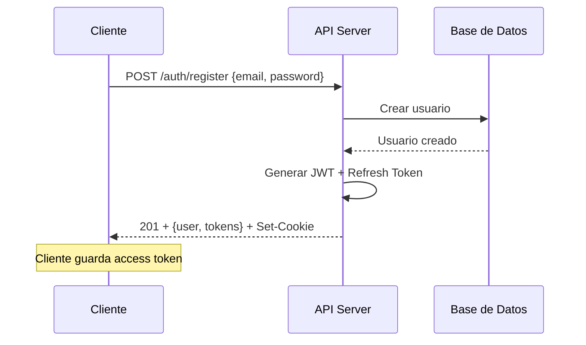
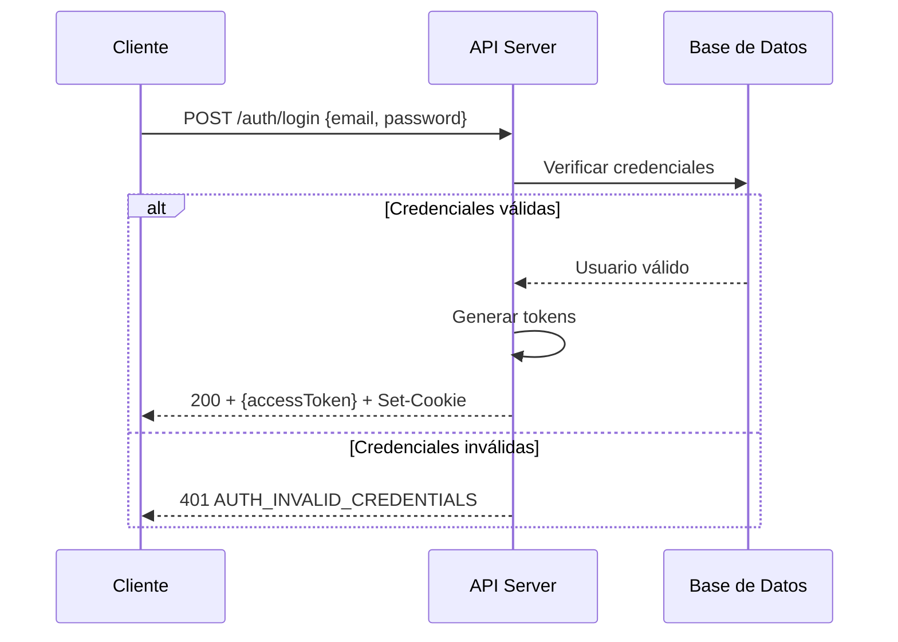
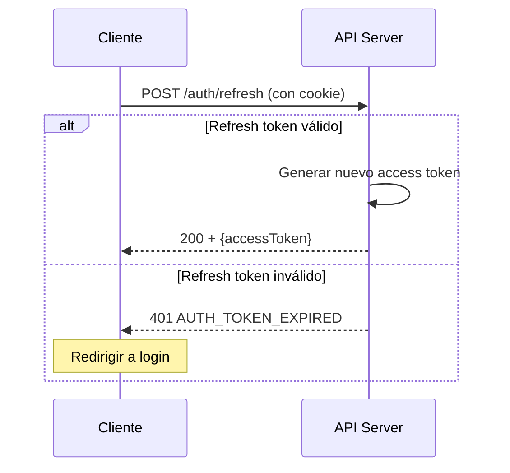
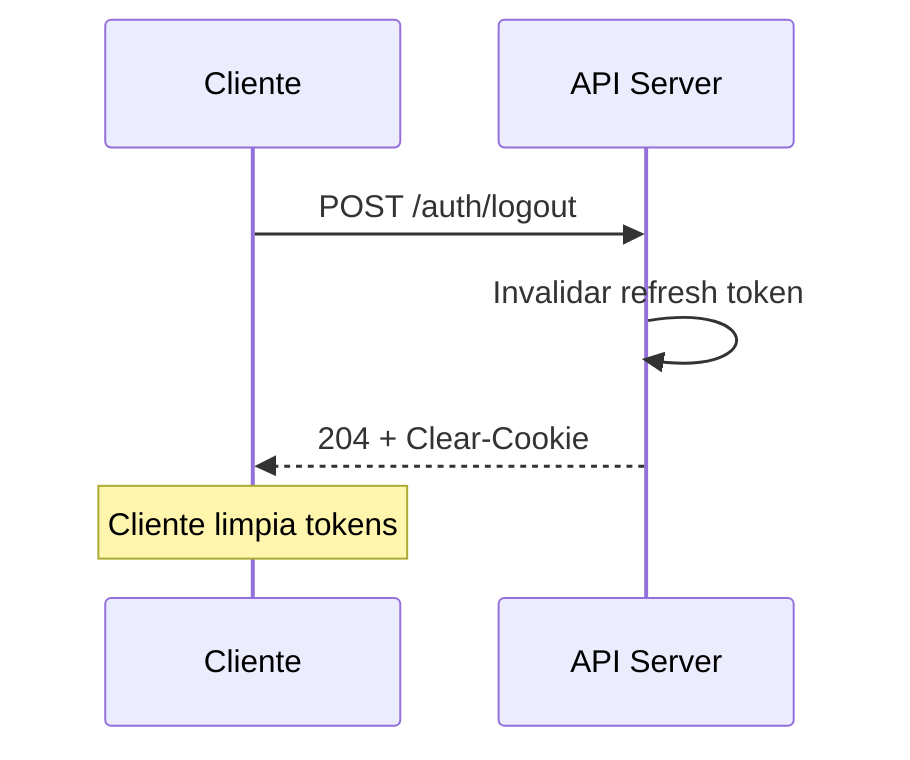
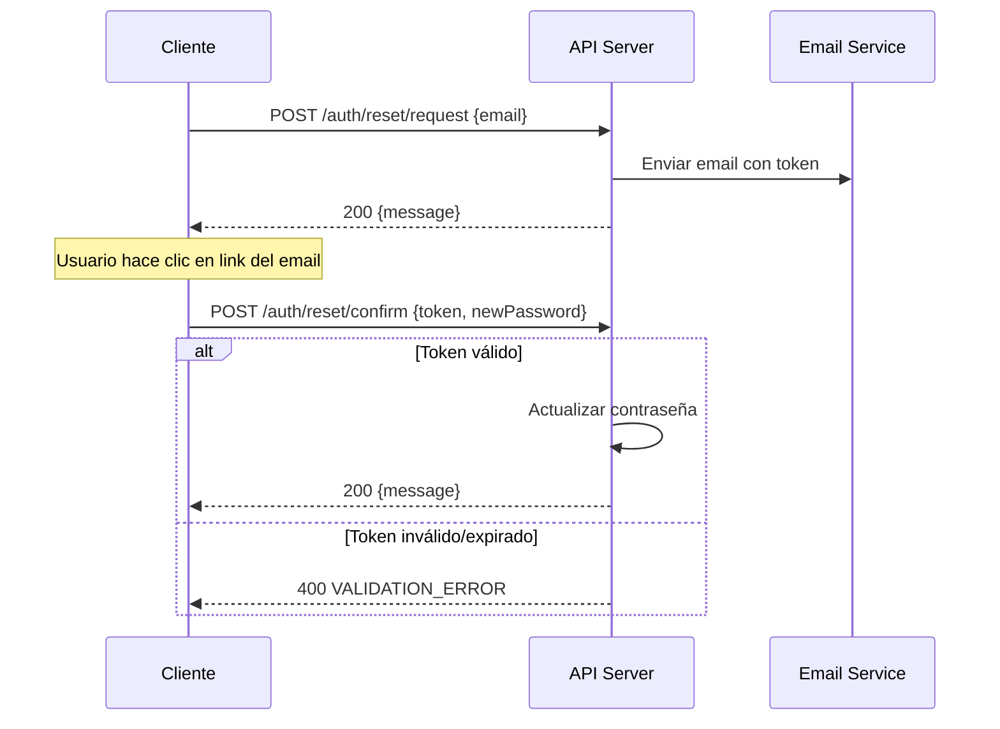

# API Contracts Documentation

Este directorio contiene los contratos de la API de Notas de Voz con IA, incluyendo la especificación OpenAPI, catálogo de errores y documentación de flujos de autenticación.

## 📋 Tabla de Contenidos

- [OpenAPI Specification](#openapi-specification)
- [Catálogo de Errores](#catálogo-de-errores)
- [Flujos de Autenticación](#flujos-de-autenticación)
- [Esquemas de Datos](#esquemas-de-datos)
- [SDK Cliente](#sdk-cliente)

## 🔧 OpenAPI Specification

La especificación completa de la API se encuentra en [`openapi.yaml`](./openapi.yaml).

### Base URLs
- **Desarrollo**: `http://localhost:4000/api/v1`
- **Producción**: `https://api.notasdevoz.com/api/v1`

### Autenticación
La API usa JWT RS256 con refresh tokens:
- **Access Token**: JWT de 15 minutos enviado en header `Authorization: Bearer <token>`
- **Refresh Token**: Cookie httpOnly de 7 días con `SameSite=Lax`

## ❌ Catálogo de Errores

Todos los errores siguen el formato estándar:

```json
{
  "error": {
    "code": "ERROR_CODE",
    "message": "Descripción del error"
  }
}
```

### Códigos de Error

| Código | HTTP Status | Descripción | Solución Sugerida |
|--------|-------------|-------------|-------------------|
| `AUTH_INVALID_CREDENTIALS` | 401 | Email o contraseña incorrectos | Verificar credenciales |
| `AUTH_TOKEN_EXPIRED` | 401 | Token JWT expirado | Renovar token con refresh |
| `FILE_TOO_LARGE` | 400 | Archivo excede 25MB | Reducir tamaño del archivo |
| `UNSUPPORTED_MEDIA_TYPE` | 400 | Formato de audio no soportado | Usar MP3, WAV, M4A, FLAC |
| `NOTE_NOT_FOUND` | 404 | Nota no encontrada | Verificar ID de nota |
| `LLM_FAILURE` | 500 | Error en servicio de IA | Reintentar más tarde |
| `STT_FAILURE` | 500 | Error en transcripción | Reintentar más tarde |
| `RATE_LIMITED` | 429 | Demasiadas peticiones | Esperar antes de reintentar |
| `VALIDATION_ERROR` | 400 | Datos de entrada inválidos | Verificar formato de datos |
| `INTERNAL_ERROR` | 500 | Error interno del servidor | Contactar soporte |

### Manejo de Errores por Categoría

#### Errores de Autenticación (401)
```typescript
if (error.code === 'AUTH_TOKEN_EXPIRED') {
  // Intentar renovar token
  await client.refreshToken();
  // Reintentar petición original
}
```

#### Errores de Rate Limiting (429)
```typescript
if (error.code === 'RATE_LIMITED') {
  // Implementar backoff exponencial
  const delay = Math.pow(2, retryCount) * 1000;
  await new Promise(resolve => setTimeout(resolve, delay));
}
```

#### Errores de Archivo (400)
```typescript
if (error.code === 'FILE_TOO_LARGE') {
  // Comprimir o dividir archivo
  const compressedFile = await compressAudio(file);
}
```

## 🔐 Flujos de Autenticación

### 1. Flujo de Registro



**Ejemplo:**
```typescript
const response = await client.registerUser({
  email: "usuario@ejemplo.com",
  password: "contraseña123"
});

// Guardar access token
client.setAccessToken(response.tokens.accessToken);
```

### 2. Flujo de Login



**Ejemplo:**
```typescript
try {
  const response = await client.loginUser({
    email: "usuario@ejemplo.com",
    password: "contraseña123"
  });
  
  client.setAccessToken(response.accessToken);
} catch (error) {
  if (error.code === 'AUTH_INVALID_CREDENTIALS') {
    // Mostrar error de credenciales
  }
}
```

### 3. Flujo de Renovación de Token



**Ejemplo:**
```typescript
try {
  const response = await client.refreshToken();
  client.setAccessToken(response.accessToken);
} catch (error) {
  if (error.code === 'AUTH_TOKEN_EXPIRED') {
    // Redirigir a login
    window.location.href = '/login';
  }
}
```

### 4. Flujo de Logout



**Ejemplo:**
```typescript
await client.logoutUser();
client.clearAccessToken();
```

### 5. Flujo de Reset de Contraseña



## 📊 Esquemas de Datos

### Estados de Nota

Las notas progresan a través de estados definidos:

```
idle → uploading → uploaded → transcribing → summarizing → ready
                                    ↓
                                  error
```

| Estado | Descripción |
|--------|-------------|
| `idle` | Nota creada sin audio |
| `uploading` | Audio subiendo |
| `uploaded` | Audio subido exitosamente |
| `transcribing` | Procesando transcripción |
| `summarizing` | Generando resumen y acciones |
| `ready` | Procesamiento completo |
| `error` | Error en procesamiento |

### Estructura de Action Item

```typescript
interface Action {
  id: string;
  text: string;
  done: boolean;
  due_suggested?: string; // ISO 8601
  createdAt: string;
}
```

### Paginación Cursor-based

```typescript
interface CursorPagination {
  items: Note[];
  cursor?: string; // Para siguiente página
}
```

**Uso:**
```typescript
// Primera página
let response = await client.listNotes();

// Página siguiente
if (response.cursor) {
  response = await client.listNotes({ cursor: response.cursor });
}
```

## 🛠 SDK Cliente

El SDK TypeScript se genera automáticamente desde la especificación OpenAPI y está disponible en `packages/sdk`.

### Instalación

```bash
pnpm add @notas-voz/sdk
```

### Configuración Básica

```typescript
import { createApiClient } from '@notas-voz/sdk';

const client = createApiClient({
  baseUrl: 'http://localhost:4000/api/v1',
  accessToken: 'tu-access-token',
  timeout: 30000,
  withCredentials: true
});
```

### Ejemplo de Uso Completo

```typescript
import { createApiClient, ApiError } from '@notas-voz/sdk';

const client = createApiClient({
  baseUrl: process.env.API_URL || 'http://localhost:4000/api/v1'
});

async function uploadAndProcessNote(audioFile: File) {
  try {
    // 1. Crear nota
    const note = await client.createNote({
      title: 'Mi reunión importante',
      tags: ['trabajo', 'reunión']
    });
    
    // 2. Subir audio
    const uploadResult = await client.uploadAudioToNote(note.id, audioFile);
    console.log('Estado después de upload:', uploadResult.note.status);
    
    // 3. Iniciar transcripción
    await client.transcribeNote(note.id);
    
    // 4. Esperar transcripción y generar resumen
    // (En una app real, usarías polling o websockets)
    await new Promise(resolve => setTimeout(resolve, 5000));
    await client.summarizeNote(note.id);
    
    // 5. Obtener resultado final
    const finalNote = await client.getNote(note.id);
    return finalNote;
    
  } catch (error) {
    if (error instanceof ApiError) {
      switch (error.code) {
        case 'FILE_TOO_LARGE':
          throw new Error('El archivo es demasiado grande (máx 25MB)');
        case 'UNSUPPORTED_MEDIA_TYPE':
          throw new Error('Formato de audio no soportado');
        case 'AUTH_TOKEN_EXPIRED':
          // Renovar token y reintentar
          await client.refreshToken();
          return uploadAndProcessNote(audioFile);
        default:
          throw new Error(`Error de API: ${error.message}`);
      }
    }
    throw error;
  }
}
```

### Manejo de Estados de Loading

```typescript
function useNoteProcessing(noteId: string) {
  const [status, setStatus] = useState<NoteStatus>('idle');
  
  const pollNoteStatus = useCallback(async () => {
    try {
      const note = await client.getNote(noteId);
      setStatus(note.status);
      
      // Continuar polling si aún está procesando
      if (['transcribing', 'summarizing'].includes(note.status)) {
        setTimeout(pollNoteStatus, 2000);
      }
    } catch (error) {
      console.error('Error polling note status:', error);
    }
  }, [noteId]);
  
  return { status, pollNoteStatus };
}
```

## 🚀 Validación y Testing

### Validar OpenAPI

```bash
npm run contracts:check
```

### Generar SDK

```bash
npm run sdk:generate
```

### Testing de Endpoints

Use las credenciales de test para desarrollo:
- **Email**: `test@example.com`
- **Password**: `password123`

```bash
# Health check
curl http://localhost:4000/api/v1/health

# Login de test
curl -X POST http://localhost:4000/api/v1/auth/login \
  -H "Content-Type: application/json" \
  -d '{"email":"test@example.com","password":"password123"}'
```

## 📚 Referencias

- [OpenAPI 3.0 Specification](https://swagger.io/specification/)
- [JWT Best Practices](https://datatracker.ietf.org/doc/html/draft-ietf-oauth-jwt-bcp)
- [HTTP Status Codes](https://httpstatuses.com/)
- [REST API Design Guidelines](https://restfulapi.net/)